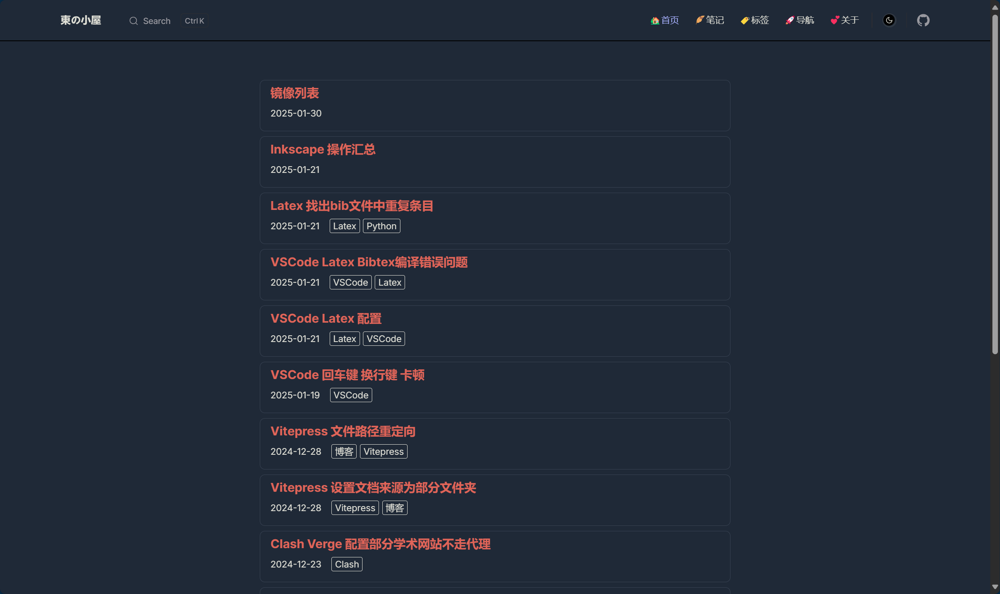

## vitepress-blog-origin

[vitepress-blog-origin](https://github.com/haodongcui/vitepress-blog-origin), 一个简洁且漂亮的 vitepress 博客, 由 [haodongcui](https://github.com/haodongcui) 开发.



该博客, 使用 vitepress 搭建, 仅在默认主题的基础上进行了修改, 自定义了布局样式, 实现了个人博客的大部分功能, 算不上 vitepress 主题, 时间原因, 也暂未整理和打包发布.


## 功能

### 已实现的功能
除了默认主题的功能外, 已实现了以下功能:
- [x] 数学公式(插件)
- [x] 导航栏毛玻璃效果(插件)
- [x] 代码块mac样式(插件)
- [x] 内容与开发分离的文件结构, 使用 Obsidian 作为 "后端" (haha)
- [x] 附了一个我喜欢的 obsidian 主题, 见 `docs/.obsidian/snippets/`.
- [x] 文章列表
- [x] 分类页面
- [x] 评论系统(仅giscus)


### 待实现或待优化功能
- [ ] 标签页面(有,但暂不好用)


## 使用

> ***暂不建议使用***, 因为结构较混乱, 还未整理, 且技术力简陋, 可以借鉴的最多也就: 文章列表的实现 、适配于 obsidian 的文件结构、 vitepress 的配色调整.

如果不嫌弃的话,可以直接:
```bash
git clone git@github.com:haodongcui/vitepress-blog-origin.git
```
安装依赖
```bash
pnpm install
```
启动项目预览
```bash
pnpm dev
```
## obsidian 使用

以 `docs/` 目录为 `obsidian` 仓库的根目录, 

只有其中的 `blog-posts/`, `blog-essays/`, `blog-info` 三个文件夹会打包发布 `github pages`,

`docs/` 下的其他文件夹、文件, 均不会发布, 故可以用来存放一些不想公开的内容, 如日记等.


## 碎碎念

>从一个未接触过前端、看不懂文档的小白, 到能自定义一个博客, 最开始是被 Jekyll 的亮眼和 Hexo 的花哨深深吸引住了, 然后就是跟着**搜索引擎**这个大师不断地摸索, 后面也用上了AI, 前前后后涉及了 [Jekyll](https://jekyllcn.com/docs/home/), [Hexo](https://hexo.io/zh-cn/), [Gitbook](https://www.gitbook.com/), [Vuepress](https://vuepress.vuejs.org/zh/), [Vitepress](https://vitepress.dev/zh/), [Astro](https://astro.build/), 入门了 Html, Css, Js, Nodejs, Vue, Astro, Tailwind, Unocss (都是浮于表面, 属于刚入门的程度, 不过接触新技术挺令人兴奋的haha), 最后又回到了 Vitepress, 学业原因, 开发这个博客断断续续的, 所以总体时间跨度上有半年左右, 不过实现自己预想功能(折腾)的过程还是挺有趣的ha~ha~.

为什么选择 [vitepress](https://vitepress.dev/zh/) 呢? 
- 一是, 功能丰富, 可定制性强, 相对 Jekyll, Gitbook 来说.
- 二是, 轻便, 现代, 相比 Hexo 来说.
- 三是, 它未来可期, 相比 Vuepress 来说, hahaha.
- 四是, 它的构建产物是一个单页面应用, 页面之间无缝切换, 这是相比 Astro 来说, 我更喜欢的一点. 


做的比较简陋, 混乱, 也没整理, 有时间了再整理打包一下, 先假装用 README 提前开个香槟, 也算是为这个项目画上了一个句号辽, haha～～.


## 参考

- vitepress 官方文档: [vitepress 官方文档](https://vitepress.dev/zh/)
- vitepress 插件汇总: [来自 yiov.top 的插件汇总](https://vitepress.yiov.top/plugin.html)
- 文章列表实现参考: [vitepress-blog-pure](https://github.com/airene/vitepress-blog-pure)
- 文章列表实现参考: [文章列表](https://juejin.cn/post/6896382276389732359)
- 配色参考: [charm | astro](https://astro-charm.vercel.app/)
- Github secrets 配置参考: [Github Actions 入门](https://zhuanlan.zhihu.com/p/364366127)
