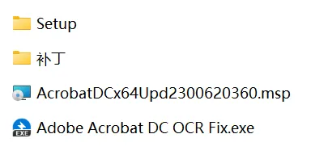
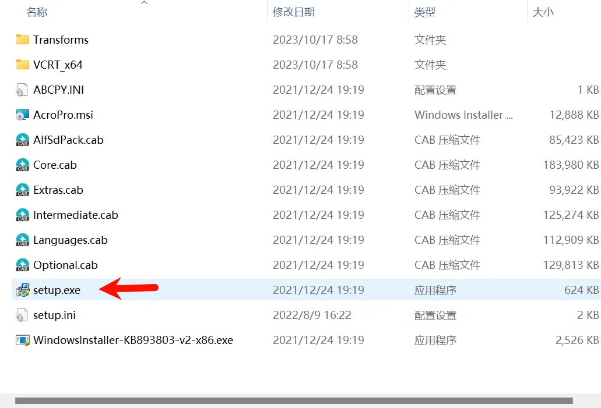
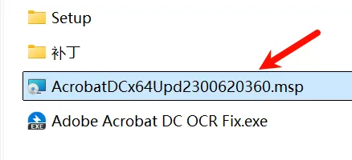
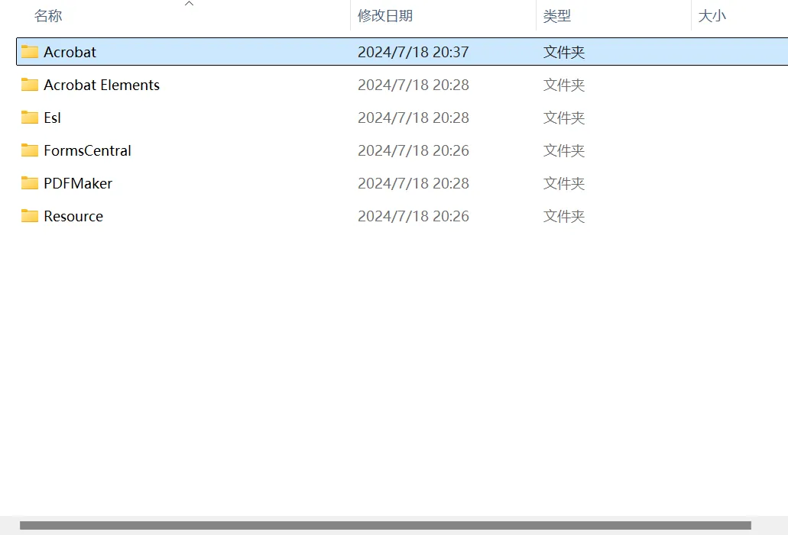
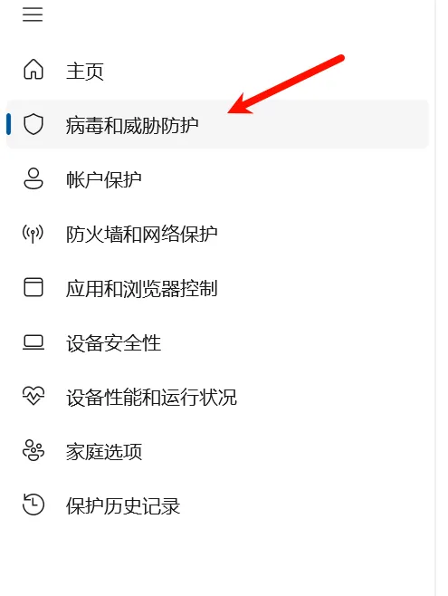
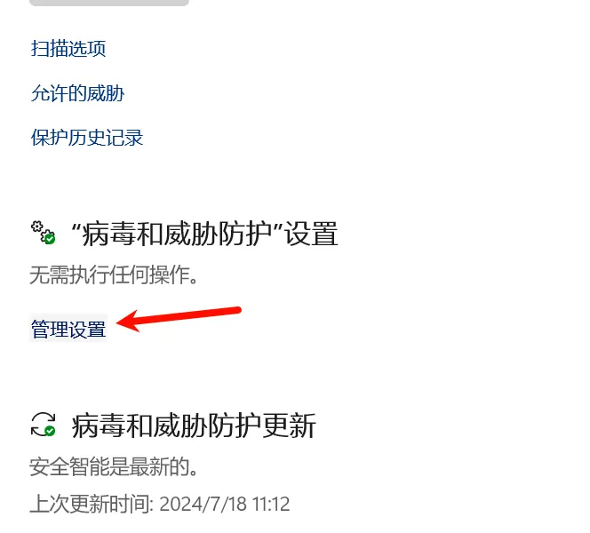
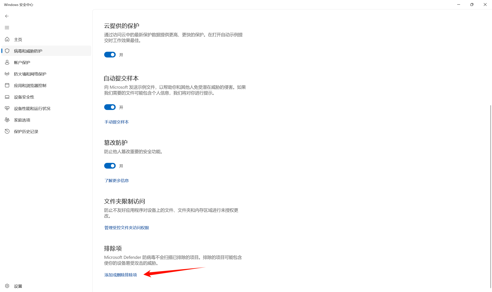

# 安装教程
## B 站视频：
[最新版Adobe Acrobat Pro DC 2023更新了，有包免费取，PDF编辑更加的稳定，速度更快！强烈推荐更新！-哔哩哔哩](https://b23.tv/610BS5o)

## 下载链接：
最新版 AdobeAcrobat2024.006.20360 PDF 编辑软件 永久免费下载

123 云盘链接： [https://www.123pan.com/s/b8Bojv-nnpJA.html](https://www.123pan.com/s/b8Bojv-nnpJA.html) 提取码: jDFm 

百度网盘链接：[https://pan.baidu.com/s/1vodbfFYg5JWYd27_fcMv-Q?pwd=n3rl](https://pan.baidu.com/s/1vodbfFYg5JWYd27_fcMv-Q?pwd=n3rl) 提取码：n3rl

# _安装步骤_
## **第一步：安装原应用**
Setup 文件夹中，右键单击 setup.exe，以管理员身份运行。
安装完成后点击关闭（不要立即启动）

## **第二步：升级**

双击 msp 文件，后点击“更新”，等待完成

## **第三步：打补丁**

点击”超级补丁.exe“（若超级补丁.exe 被 Windows 安全中心自动删除，请查看解决方案 [补充：超级补丁.exe被删除解决方案](#补充：超级补丁.exe被删除解决方案)）

第一步：点 Path，选择“Acrobat”
默认安装路径：C:\Program Files\Adobe\Acrobat DC

第二步：点 Search
第三步：点 Patch，等三个都完毕后，就可以退出该补丁程序了（若没补完就被 Windows 安全中心删了，重新按照打补丁的步骤再重复一遍，直至抢在被删之前 Patch 完）

## 第四步：打开软件，关闭自动更新
双击桌面上的快捷方式即可打开

第一步：
编辑 -->首选项 -->更新程序 -->叉掉自动安装程序的勾
第二步：
打开控制面板 -->搜索服务 -->查看本地服务 -->找到 Adobe Acrobat Update Service-->右键选择属性，把启动类型改为禁用 -->点击应用 -->点击确认

## 补充：超级补丁.exe 被删除解决方案
若”超级补丁.exe“被莫名其妙被 Windows 安全中心删了，就将其所在文件夹添加到安全中心的排除项，步骤如下

**step1**

**step2**

**step3 添加排除项**

将 AdobeAcrobatProDC2023.006.20360 所在的文件夹路径添加到排除项

