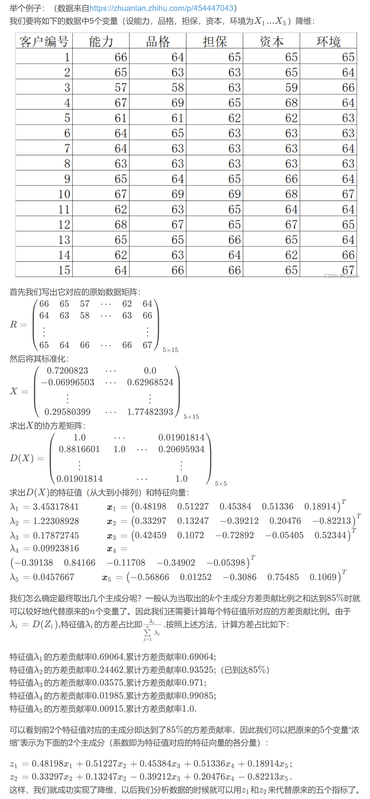
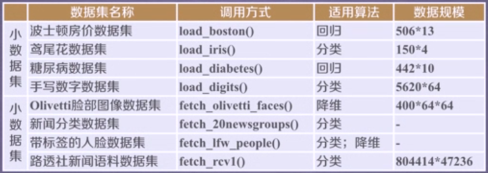
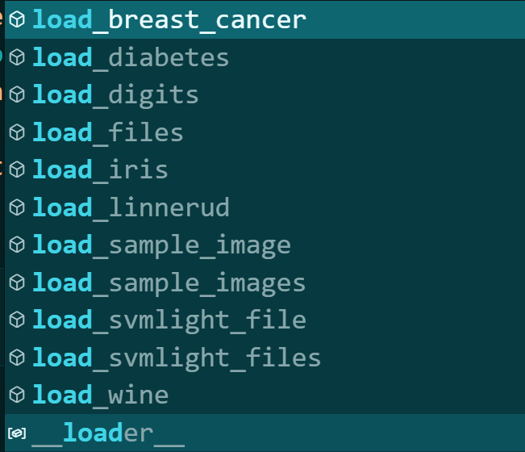
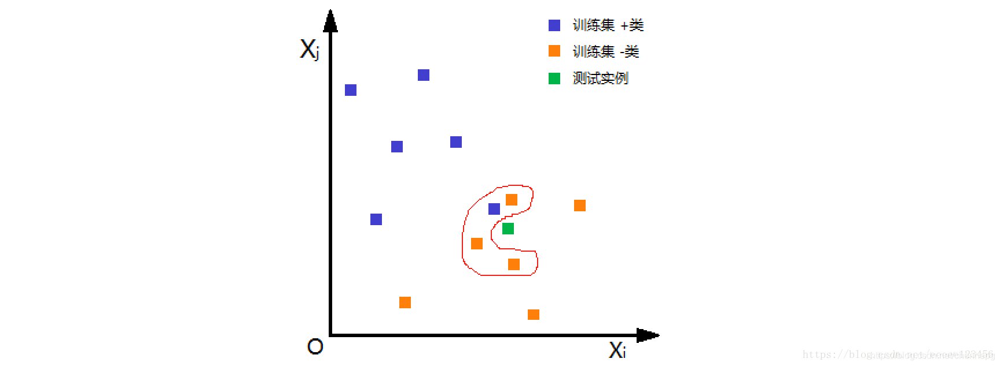
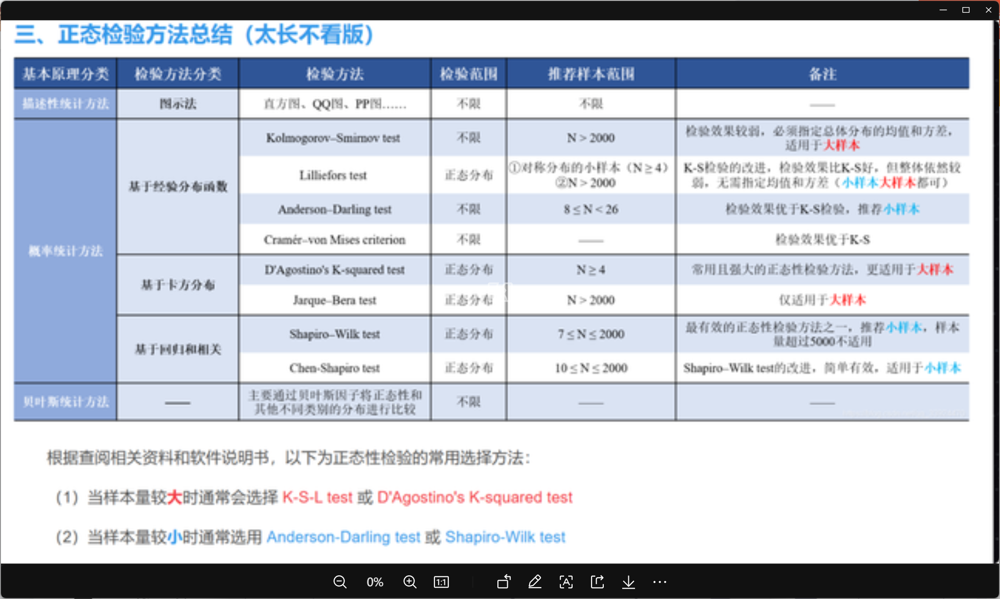

# TOPSIS 法

**计算得分**

TOPSIS 法（Technique for Order Preference by Similarity to Ideal Solution），逼近理想解排序法，优劣解距离法。

>其基本原理，是通过检测评价对象与最优解、最劣解的距离来进行排序，若评价对象最靠近最优解同时又最远离最劣解，则为最好；否则不为最优。其中最优解的各指标值都达到各评价指标的最优值。最劣解的各指标值都达到各评价指标的最差值。

## 建模步骤

1. 将原始矩阵正向化
2. 将正向化矩阵标准化
3. 计算得分并归一化

### 第一步：将原始矩阵正向化
>- 极大型（效益型）指标
>- 极小型（成本型）指标
>- 中间型指标
>- 区间型指标

1. 极小型 -> 极大型：
- $u_i = \max \{ x \} - x_i$

- $u_i = \frac{1}{x_i}$

2. 极小型 -> 极大型：

- $u_i = 1 - \frac{| x_i - x_{best} |}{M} , \quad M = \max \{ | x_i - x_{best} | \}$

3. 区间性 -> 极大型

 $$
u_i=
\begin{cases}
1-\frac{a-x_i}{M},\quad &x_i<a \\
1, & a \le x_i \le b \\
1-\frac{x_i-b}{M},&x_i>b
\end{cases}
$$

其中 $M=\max\{ a-\min\{x_i\}, \max\{x_i\}-b \}$

### 第二步：将正向化矩阵标准化
设正向化矩阵为 $U = (u_{ij})_{n\times m}$，n 个样本，m 个评价指标，
消除不同指标量纲的影响，作标准化：

$$z_{ij}=\frac{u_{ij}}{\sqrt{ \sum_{j=1}^{m} u_{ij}^{2} }}$$

得到标准化矩阵 $Z=(z_{ij})_{n\times m}$

### 第三步：计算得分并归一化（核心）

每列的最大值 $Z_j^+ =\max \{z_{1j},z_{2j},...,z_{nj}\}$， $Z^+ =( Z_1^+,...,Z_m^+ )$
每列的最小值 $Z_j^- =\min \{z_{1j},z_{2j},...,z_{nj}\}$， $Z^- =( Z_1^-,...,Z_m^- )$

方案一：
第 i 个评价对象与最大值的距离 $D_i^+ =\sqrt{\sum_{j=1}^{m} (Z_j^+ - z_{ij} )^2 }$
第 i 个评价对象与最小值的距离 $D_i^- =\sqrt{\sum_{j=1}^{m} (Z_j^- - z_{ij} )^2 }$
>注：默认各指标**权重相同**，故当各评价指标单位正交时，最适用

方案二：
第 i 个评价对象与最大值的距离 $D_i^+ =\sqrt{ \sum_{j=1}^{m} w_j (Z_j^+ - z_{ij} )^2 }$
第 i 个评价对象与最小值的距离 $D_i^- =\sqrt{\sum_{j=1}^{m} w_j (Z_j^- - z_{ij} )^2 }$
>注：各指标的**权重不同**，为 $w_j$，求权重的方法可使用熵权法

第 i 个评价对象的得分 $G_i =\frac{ D_i^- }{ D_i^+ + D_i^- }$
>注：$0 \le G_i \le 1$，且 $G_i$ 越大，距离最小值越远，距离最大值越近，即 $G_i$ 越大越好。

对得分归一化（可选） $S_i =\frac{ G_i }{ \sum_{i=1}^{n} G_i }$

# 信息论

## 信息量

信息量是对事件的不确定性的减少量的度量，单位比特（bit）
定义：在随机变量 X 中，事件 x 的 (自) 信息量

$$
\begin{aligned}
I(X=x) 
&= \log 1 - \log p(x) \\
&= -\log_2 p(x) 
\end{aligned}
$$

>注：
>底为 2，单位为 bit
>底为 e，单位为 nat
>底为 10，单位为 Hart

发生概率越大的事件，其发生带来的信息量越小，信息编码长度越短；
发生概率越小的事件，其发生带来的信息量越大，信息编码长度越长。

## 信息熵

香农的信息熵公式

$$ H(x) = -\sum_{i=1}^{n} p(x_i) \log( p(x_i) ) $$

其中，$p(x_i)$ 表示随机事件 $x_i$ 发生的概率，对数的底数任意，一般选为 2。

假设：不相关且独立

设信息量为 $h(x)$ ，由
1. 两个不相关事件同时发生的信息 等于 两个不相关事件各自发生的信息
2. 两个事件独立
得到：
1.  $h(x,y) =h(x)+h(y)$
2.  $p(x,y) =p(x)*p(y)$

由
1. 对数的运算定义
2. 事件发生概率越大，信息量越少，递减
3. 信息量是正数，$0\le p(x) \le1$
得到香农信息量为

$$ h(x) =-\log p(x) $$

信息熵 是信息量的期望 $H(x) =\sum p(x)h(x)$，故**香农信息熵**为

$$ H(x) = -\sum_{i=1}^{n} p(x_i) \log( p(x_i) ) $$

>**信息熵与信息量的区分**，参见：[(3 封私信 / 30 条消息) 信息熵越大，信息量到底是越大还是越小？ - 知乎 (zhihu.com)](https://www.zhihu.com/question/274997106/answer/1055696026)

>**信息量 $\iff$ 不确定度的减少量 $\iff$ 熵减
>信息熵 $\iff$ 随机事件的不确定程度 $\iff$ 信息量的期望**
>故得到：
>**单位量确定后，信息量的变化等价于信息熵**（先不考虑正负）

# 熵权法

对于某评价指标，可以用熵值来判断某个指标的离散程度：
某指标的信息熵越小，则离散程度越大， 对综合评价的影响就越大，即权重越大。
>特例：若某指标的取值全部相等，则信息熵为 0，信息极端集中，则该指标在综合评价中不起作用，权重为 0

参考链接：[清风数学建模学习笔记——熵权法（客观赋权法）-CSDN博客](https://blog.csdn.net/weixin_43819566/article/details/112396912)

## 建模步骤

1. 标准化，同质化（正向化）
2. 各指标在各样本中的比重（横向占比）
3. 求各指标的信息熵（纵向信息熵）
4. 信息效用值（信息冗余度）、熵权

### 第一步：标准化、同质化

设有 n 个评价对象（样本），m 个评价指标，构成矩阵为 $X =(x_{ij})_{n\times m}$
对每列消除量纲影响，并正向化（正向化不止这一种方法，参考 TOPSIS 章节），采用**极差变化法**：
正向指标

$$ u_{ij} = \frac{ x_{ij}-\min \{ x_{1j},...,x_{nj} \} }{ \max \{ x_{1j},...,x_{nj} \}  - \min \{ x_{1j},...,x_{nj} \}  } $$

负向指标

$$ u_{ij} = \frac{ \max \{ x_{1j},...,x_{nj} \} - x_{ij} }{ \max \{ x_{1j},...,x_{nj} \}  - \min \{ x_{1j},...,x_{nj} \}  } $$

### 第二步：各指标在各样本中的比重（横向占比）
在同一指标下，各样本取值占各样本的比重

$$p_{ij} =\frac{u_{ij}}{ \sum_{i=1}^{n} u_{ij} }$$

### 第三步：求各指标的信息熵（纵向信息熵）
求各指标（各列）的信息熵（同一指标下，样本取值的信息量的期望）

$$ H_j = - \frac{1}{\ln n} \sum_{i=1}^{n} p_{ij} \ln p_{ij} $$

>注：
>1. 除以 $\ln n$ 是为了使信息熵始终在 $[0,1]$ 区间上；
>2. 信息熵越大，信息量越少。

### 第四步：信息效用值（信息冗余度）、熵权

各指标的信息效用值：

$$d_j =1-H_j$$

信息效用值越大，信息量越大。

将信息效用值归一化，得到各指标的**熵权**：

$$ w_j = \frac{d_j}{\sum_{j=1}^{m} d_j } $$

# 基于熵权法的 TOPSIS 模型

利用熵权法求得权重，求得权重后，采用权重不同的 TOPSIS 法。
参考 [TOPSIS法](#TOPSIS法) 和 [熵权法](#熵权法)

# 灰色关联分析

基本思想：是根据序列曲线几何形状的相似程度来判断其联系是否紧密，曲线越接近，相应序列之间的关联度就越大，反之则越小。

适用情况：样本量较少

参考链接：[清风数学建模学习笔记——灰色关联分析(GRA)详细解读与案例分析_灰色关联度实列分析-CSDN博客](https://blog.csdn.net/weixin_43819566/article/details/112914383)

## 建模步骤

1. 预处理：指标正向化、数据标准化
2. 确定分析数列
3. 计算子序列中各个指标与母序列的关联系数
4. 计算灰色关联度，并得出结论

### 第一步：指标正向化、数据标准化

目的：
1. 异质指标同质化
2. 消除量纲的影响
3. 缩小变量范围，简化计算

参考 [TOPSIS法](#TOPSIS法) 的正向化操作，得到正向化矩阵 $X=(x_{ij})_{n\times m}$

标准化，得到标准化矩阵 $Z=(z_{ij})_{n\times m}$，其中 $z_{ij}=\frac{x_{ij}}{\sum_{i=1}^{n}x_{ij}}$

### 第二步：确定分析数列

1. 母序列（又称参考数列，母指标）：能反映系统应为特征的数据序列，其类似于因变量，此处记为 $x_0 =\{x_0(k)\}_{k=1}^{n}$
2. 子序列（又称比较数列，子指标）：影响系统行为的因素组成的数据序列，其类似于自变量，此处记为 $x_j = \{x_j(k)\}_{k=1}^{n}$，$j=1,...,m$

>母序列的选取：
>**当指标间相关性低的时候，选择每行中最大的构成母序列**

**母序列构造后，再次进行标准化**

### 第三步：计算子序列中各个指标与母序列的关联系数

定义灰色系数，即各指标的关联系数为：

$$ y(x_0(k),x_j(k)) = \frac{ a+\rho b }{ |x_0(k)-x_j(k)|+\rho b } $$

其中 $k=1,...,n$，$j=1,...,m$， a 为两极最小差，b 为两极最大差，$\rho$ 为分辨系数（一般取值 0.5）

$$a=\min_j \min_k |x_0(k)-x_j(k)|$$

$$b=\max_j \max_k |x_0(k)-x_j(k)|$$

### 第四步：计算灰色关联度，并得出结论

定义 $y(x_0,x_j)$ 为灰色关联度如下，即对关联系数矩阵每列求均值：

$$y(x_0,x_j) = \frac{1}{n} \sum_{k=1}^{n} y(x_0(k),x_j(k))$$

### 第五步：归一化，得到权重

归一化，得权重：

$$ w_j = \frac{y(x_0,x_j)}{ \sum_{j=1}^{m} y(x_0,x_j } $$

>可使用熵权法或灰色关联分析计算权重，再使用 TOPSIS 法计算评价得分

# 相关系数

参考链接：[三大统计相关系数：Pearson、Spearman秩相关系数、kendall等级相关系数-CSDN博客](https://blog.csdn.net/zhaozhn5/article/details/78392220)

三大相关系数：
1. Pearson 相关系数（皮尔逊）
2. Spearman Rank 相关系数（斯皮尔曼）
3. Kendall Rank 相关系数（肯德尔）

相关性强弱
- 0.8-1.0     极强相关  
- 0.6-0.8     强相关  
- 0.4-0.6     中等程度相关  
- 0.2-0.4     弱相关  
- 0.0-0.2     极弱相关或无相关

>后两个相关系数的 Rank 与矩阵的秩无关，这里仅仅是用来表示“排名/等级”的意思。

## Pearson 相关系数

适用范围：
1. 两个变量之间是**线性关系**，都是**连续**数据
2. 两个变量的总体是**正态分布**，或接近正态的单峰分布
3. 两个变量的观测值是成对的，每对观测值之间相互独立。

公式：

$$
\rho(X,Y) 
= \frac{cov(X,Y)}{\sigma_X \sigma_Y}
= \frac{E( (X-\mu_X)(Y-\mu_Y) )}{\sigma_X \sigma_Y}
= \frac{E(XY)-E(X)E(Y)}{ \sqrt{E(X^2)-E^2(X)} \sqrt{E(Y^2)-E^2(Y)} }
$$

## Spearman Rank 相关系数

适用范围：
- 全能，无所谓，其他的不满足就用这个

简单易行的公式：

$$ \rho = 1 - \frac{ 6\sum_{i=1}^{n} d_i^2 }{n(n^2-1)} $$

其中，$d_i=x_{ij_1} - x_{ij_2}$ （$i=1,...,n$）表示第 i 个数据对儿的位次值之差

## Kendall Rank 相关系数

适用范围：
- 与斯皮尔曼秩相关系数相同

用的不多，本文不整理

# 智能优化算法

## 模拟退火算法

原理参考：[智能优化算法学习笔记（2）–模拟退火算法（SA）_metropolis准则-CSDN博客](https://blog.csdn.net/qq_43808253/article/details/130636586)

代码参考：[模拟退火算法的Python实现（非线性函数优化为例）_模拟退火解决非线性规划问题-CSDN博客](https://blog.csdn.net/qq_43445362/article/details/108364134)

## 遗传算法

参考链接：[遗传算法详解 附python代码实现_遗传算法python-CSDN博客](https://blog.csdn.net/ha_ha_ha233/article/details/91364937?app_version=6.4.2&code=app_1562916241&csdn_share_tail=%7B%22type%22%3A%22blog%22%2C%22rType%22%3A%22article%22%2C%22rId%22%3A%2291364937%22%2C%22source%22%3A%22haodongcui%22%7D&uLinkId=usr1mkqgl919blen&utm_source=app)

## 粒子群算法

## 蚁群算法

# 回归

## Logistic

## Prophet 模型

加法模型：

$$y(t)=g(t)+s(t)+h(t)+\epsilon(t)$$

乘法模型：

$$y(t)=g(t)*s(t)*h(t)*\epsilon(t)$$

模型整体由三部分组成：
- growth(增长趋势)  
- seasonality(季节趋势)  
- holidays(节假日对预测值的影响)
- 噪声

其中：
- g(t) 表示时间序列的趋势，
- s(t) 表示时间序列的周期项或季节性，
- h(t) 表示时间序列的假期效应，表示时间序列中那些潜在的具有非固定周期的节假日对预测值造成的影响，
- $\epsilon(t)$ 表示模型的误差项。表示模型未预测到的波动， 服从高斯分布。
	- 在加法模型中，趋势、季节性和假期效应都是原始值，并且都被解释为相对于时间序列的平均水平的偏差。
	- 在乘法模型中，趋势、季节性和假期效应都表示为百分比变化，并且都被解释为相对于时间序列的平均水平的偏差。

Prophet 算法就是通过拟合这几项，然后把它们累加或累乘，得到时间序列的预测值。

适用范围：
- 加法模型适用于时间序列的趋势和季节性与数据规模无关的情况，例如气温和降雨量；
- 乘法模型适用于时间序列的趋势和季节性与数据规模相关的情况，例如商品销售量和股票价格。

# 降维

## 适用性检验
### 球形检验（Bartlett's Test）

球形检验的假设：
H0：相关系数矩阵为单位阵（即变量不相关）
H1：相关系数矩阵不是单位阵（即变量间有相关关系）

### KMO 统计量检验（Kaiser-Meyer-Olkin Test）

KMO 的值在 0,1 之间，该值越大，则样本数据越适合作主成分分析和因子分析。一般要求该值大于 0.5，方可作主成分分析或者相关分析。

经验原则：
0.9 以上       适合性很好
0.8~0.9 适合性良好
0.7~0.8 适合性中等
0.6~0.7 适合性一般
0.5~0.6 适合性不好
0.5 以下       不能接受的   

## 主成分分析（PCA）

概念：主成分分析是一种统计方法，通过正交变换将一组可能存在相关性的变量转换成一组线性不相关的变量，转换后的这组变量叫主成分。

思想：PCA 的思想是将 n 维特征映射到 m 维上（m<n），这 m 维是全新的**正交**特征，称为**主成分**，这 m 维的特征是**重新构造**出来的，不是简单的从 n 维特征中减去 n-m 维特征。PCA 的核心思想就是将数据沿最大方向投影，数据更易于区分。

维基详解：
- 将坐标轴中心移到数据的中心，然后旋转坐标轴，使得数据在 C1 轴上的方差最大，即全部 n 个数据个体在该方向上的投影最为分散。意味着更多的信息被保留下来。C1 成为**第一主成分**。
- C2**第二主成分**：找一个 C2，使得 C2 与 C1 的 [协方差](https://zh.wikipedia.org/wiki/%E5%8D%8F%E6%96%B9%E5%B7%AE "协方差")（[相关系数](https://zh.wikipedia.org/wiki/%E7%9B%B8%E5%85%B3%E7%B3%BB%E6%95%B0 "相关系数")）为 0，以免与 C1 信息重叠，并且使数据在该方向的方差尽量最大。
- 以此类推，找到第三主成分，第四主成分……第 p 个主成分。p 个随机变量可以有 p 个主成分。

参考链接：
- [主成分分析 - 维基百科，自由的百科全书 (wikipedia.org)](https://zh.wikipedia.org/zh-cn/%E4%B8%BB%E6%88%90%E5%88%86%E5%88%86%E6%9E%90)
- [主成分分析法(PCA)及其python实现_python pca-CSDN博客](https://blog.csdn.net/wyn1564464568/article/details/125898241)

### 步骤

1. 将原始数据矩阵 R 标准化，得到 X
2. 求 X 的协方差矩阵 D(X)
3. 求 D(X) 的特征值和将其对角化所需要的正交矩阵 P
4. 方差第 i 大的主成分的系数 就是 第 i 大特征值对应的特征向量

例子：

## 因子分析

因子分析是**在主成分分析法的基础上**进行因子旋转，使得因子载荷重新分布，从而使得新因子能够很好的**解释**之前的因子。

适用要求：
- 变量是连续变量，分类变量不适合直接进行因子分析
- 适用性检验：球形检验、KMO 检验

提取因子个数的标准：
- 初始特征值大于 1 的因子个数
- 累积方差贡献率达到一定水平（60%）的因子个数
- **碎石图**中处于较陡峭曲线上所对应的因子个数
- 依据对研究事物的理解而指定因子个数

# 回归

参考链接：
- [sklearn实现12种回归模型_sklearn回归模型-CSDN博客](https://blog.csdn.net/qq_43751211/article/details/115372774)

## sklearn 数据集

`sklearn.datasets` 中的数据集总览：
旧：

新：

## k 近邻算法（KNN） 监督学习

参考链接：[K-近邻算法： k-nearest neighbor classification (kNN) 详细介绍-CSDN博客](https://blog.csdn.net/chenhepg/article/details/105409153)

基本做法的三个要点是：  
第一，确定距离度量；  
第二，k 值的选择（找出训练集中与带估计点最靠近的 k 个实例点）；  
第三，分类决策规则。

如下图，根据欧氏距离，选择 k=4 个离测试实例最近的训练实例（红圈处），再根据多数表决的分类决策规则，即这 4 个实例多数属于“- 类”，可推断测试实例为“- 类”。

距离度量：
- 闵可夫斯基距离
- p=1 曼哈顿距离
- p=2 欧氏距离
- p=$\infty$ 切比雪夫距离（各个坐标距离的最大值）

k 值选择：
（1）从 k=1 开始，使用检验集估计分类器的误差率。  
（2）重复该过程，每次 K 增值 1，允许增加一个近邻。  
（3）选取产生最小误差率的 K。

## SVM（Support Vector Machines）

## 高斯过程回归

## 分布检验

检验方法汇总

常用 Kolmogorov-Smirnov 统计量（KS Statistics）检验
参考链接：[单样本K-S检验_非参数统计单样本ks检验案例python-CSDN博客](https://blog.csdn.net/m0_72410588/article/details/130637458#:~:text=%E5%8D%95%E6%A0%B7%E6%9C%ACK-S%E6%A3%80%E9%AA%8C%EF%BC%88K)

# 画图

## 核密度
非参数估计

平滑内核
- 高斯核密度估计，Gaussian Kernel Density（更为常用）
不平滑内核
- Tophat Kernl Density

核密度估计（Kernel density estimation），是一种用于估计概率密度函数的非参数方法，$x_1,...,x_n$ 为独立同分布 F 的 n 个样本点，设其概率密度函数为 f，核密度估计为以下：

$$\hat{f}_h(x)=\frac{1}{n}\sum_{i=1}^{n}K_h(x-x_i) =\frac{1}{nh}\sum_{i=1}^{n}K(\frac{x-x_i}{h})$$

K(·) 为核函数
h>0 为一个平滑参数，称作带宽 (bandwidth)

# 聚类

## k-means 与 k-means++

K-means++ 算法是 k-means 算法的拓展，在初始化簇中心时，摒弃了 K-means 算 法随机初始化的思想，其选择初始化聚类中心的原则是初始化簇中心之间的相互距离 要尽可能地远。

sklearn.cluster.KMeans 对于初始聚类中心的选择默认是 k-means++

# 

